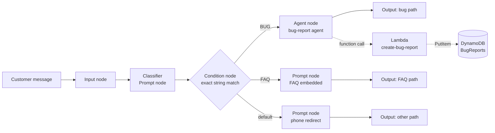
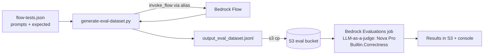

# Architecture — Customer Support Chatbot with Amazon Bedrock Flows

This document describes the architecture of the customer support chatbot: the Bedrock Flow that classifies and routes customer messages, the Lambda-backed bug-report tool, and the automated testing and evaluation pipeline.

All resources live in **us-east-1**. This is not just a preference: Bedrock Agents (Agents Classic) is only available in us-east-1, us-east-2, and us-west-2, and smaller regions may lack other Bedrock features (Flows, Evaluations) used here.

## Overview

The chatbot serves a fictional online shop. Every incoming customer message is classified into one of three categories and routed to a dedicated handler:

| Category | Handler | Outcome |
|----------|---------|---------|
| `BUG` | Bedrock Agent with a Lambda tool | Collects details and creates a ticket in DynamoDB |
| `FAQ` | Prompt node with the FAQ embedded | Answers questions about orders, shipping, returns, payments |
| `OTHER` | Prompt node | Politely redirects to the human support phone line |



## Model selection

The project uses **Amazon Nova** models throughout (any Bedrock-supported model would work):

| Component | Model | Why |
|-----------|-------|-----|
| Classifier Prompt node | Nova Lite | Single-label classification; fast and cheap, temperature 0 |
| Bug-report Agent | Nova Pro | Multi-turn conversation + reliable function calling |
| FAQ Prompt node | Nova Lite | Grounded extraction from an embedded document |
| Other-path Prompt node | Nova Micro/Lite | Trivial templated redirect |
| Evaluation judge | Nova Pro (`amazon.nova-pro-v1:0`) | Fixed by the eval role's IAM policy, which allows `bedrock:InvokeModel` on this model only |

The account must have **model access enabled** for the chosen models in the Bedrock console before the flow can be prepared or invoked.

## Bedrock Flow design

### Input node

A single Input node receives the customer message as a `document`. Its **node name** matters operationally: the test harness (`generate-eval-dataset.py`) addresses the flow input by this name via `flow-tests.json` → `flowInputNode.nodeName`.

### Classifier (Prompt node)

A Prompt node instructs the model to classify the message and output **exactly one label** — one of `BUG`, `FAQ`, or `OTHER` — with no punctuation, explanation, or whitespace around it. Predictable output is critical because the downstream Condition node uses **exact string matching**; any drift ("Category: BUG", trailing newline, lowercase) breaks routing.

Prompt-engineering measures used to keep the output deterministic:

- Enumerate the allowed labels and state that any other output is invalid.
- Define each category with concrete examples (bug = something on the site is broken/misbehaving; FAQ = questions about orders, shipping, returns, payments, products, account, privacy; OTHER = everything else, including small talk and off-topic requests).
- Low temperature (0) and a small max-token budget.
- The customer message is delimited clearly (e.g. inside tags) so instructions in the message itself are less likely to override the task — a first line of defence against prompt injection.

### Condition node (routing)

The Condition node compares the classifier output against the literal strings `BUG` and `FAQ`; the **default branch** catches `OTHER` and any unexpected output. Routing misclassified-but-valid output to the safest path (human redirect) is intentional: an unknown label should never reach the bug-report agent or fabricate an FAQ answer.

Each branch terminates in its **own Output node** — Bedrock Flows does not allow one Output node to receive multiple incoming connections.

### Bug-report path (Agent node)

A Bedrock Agent (Agents Classic) handles bug reports conversationally:

- **Action group** `bug-report-actions` exposes one function, `create_bug_report`, backed by the Lambda from the tool stack. Parameters: `description` (required), `stepsToReproduce` (optional), `environment` (optional).
- **User input enabled** (Advanced settings) so the agent can ask follow-up questions when the initial report is missing details. In a flow invocation this surfaces as a `flowMultiTurnInputRequestEvent`, which the test harness treats as a terminal response for a single-turn test.
- Agent instructions: acknowledge the issue, gather the three parameters (asking only for what is missing), call the tool once, and confirm to the customer with the returned `ticketId`.
- After any change the agent must be **prepared** (and the flow re-prepared/aliased) for changes to take effect.

### FAQ path (Prompt node)

The full [online_shop_faq.md](../src/online_shop_faq.md) (~32 Q&As, small enough for the context window) is embedded verbatim in the prompt. The model must answer **only** from the FAQ; if the FAQ does not cover the question, it redirects the customer to the support phone line instead of guessing. This keeps answers grounded and avoids hallucinated policies.

Embedding the document is the right trade-off here: the FAQ is short and stable. A larger or frequently changing corpus would call for RAG via a Bedrock Knowledge Base (a stand-out extension, out of core scope).

### Other path (Prompt node)

A minimal prompt produces a short, polite response acknowledging the customer and directing them to the human support phone line. No tools, no FAQ.

## Bug-report tool chain

Deployed by [cloudformation-tool.yaml](../src/cloudformation-tool.yaml) as stack `bug-report-tool-stack`:

| Resource | Name pattern | Purpose |
|----------|--------------|---------|
| DynamoDB table | `BugReports-<suffix>` | One item per ticket, hash key `ticketId`, on-demand billing |
| Lambda function | `create-bug-report-<suffix>` | Validates the agent's function call and writes the ticket |
| IAM role | `create-bug-report-role-<suffix>` | Lambda execution role: CloudWatch logs + `dynamodb:PutItem` on the table only |
| Lambda permission | — | Allows `bedrock.amazonaws.com` to invoke the function |

`<suffix>` is derived from the stack ID, so names are unique per deployment — actual names come from stack outputs, not hardcoded values. The table name reaches the Lambda through the `TABLE_NAME` environment variable.

**Ticket schema** (written by [create_bug_report.py](../src/create_bug_report.py)):

```json
{
  "ticketId": "<uuid4>",
  "description": "…",
  "stepsToReproduce": "…",
  "environment": "…",
  "status": "OPEN",
  "createdAt": "<ISO-8601 UTC>"
}
```

The Lambda speaks the Bedrock Agents **function-details** protocol: it validates `messageVersion == "1.0"` and `function == "create_bug_report"`, extracts named parameters, requires a non-empty `description`, and returns a `functionResponse` whose TEXT body carries `{"ticketId": …, "status": "OPEN"}` (or a structured error). The agent relays the ticket ID back to the customer.

### Verifying the tool in isolation

Before the Lambda is wired into the agent, it is verified standalone with a console test event that mimics an agent function call (`messageVersion: "1.0"`, `function: "create_bug_report"`, `actionGroup: "bug-report-actions"`, and the three parameters). A successful test returns a `ticketId` with `"status": "OPEN"`, and the corresponding item appears in the DynamoDB table. This isolates tool bugs from agent-configuration bugs.

Common failure modes: `AccessDeniedException` → the DynamoDB policy is not attached to the Lambda's execution role; `ResourceNotFoundException` → the `TABLE_NAME` environment variable does not match the actual table name.

## Testing and evaluation pipeline

Bedrock Evaluations cannot invoke a Flow directly, so the pipeline uses **Bring Your Own Inference**: run the flow ourselves, capture responses, and let an evaluator model judge them.



1. **Test suite** — `flow-tests.json` (from [flow-tests-template.json](../src/flow-tests-template.json)) lists prompts covering all three paths, plus edge cases (ambiguous, very short, prompt-injection attempts). Each test carries an `expected` description used as the judge's reference response.
2. **Dataset generation** — [generate-eval-dataset.py](../src/generate-eval-dataset.py) invokes the flow once per prompt through a **flow alias** (`invoke_flow` on `bedrock-agent-runtime`) and writes one JSONL record per test: `prompt`, `referenceResponse`, `modelResponses[0]` with identifier `my-flow-app`. Flow failures are captured as `[FLOW_ERROR] …` records rather than aborting the run.
3. **Evaluation resources** — [cloudformation-testing.yaml](../src/cloudformation-testing.yaml) (stack `bug-report-testing-stack`) creates the S3 bucket `udacity-agentic-engineer-c1-eval-<account-id>` and the `bedrock-eval-role` that Bedrock Evaluations assumes (S3 read/write on the bucket, `bedrock:InvokeModel` on Nova Pro only).
4. **Evaluation job** — `aws bedrock create-evaluation-job` with task type `General`, metric `Builtin.Correctness`, evaluator model `amazon.nova-pro-v1:0`, and a `precomputedInferenceSource` matching the dataset's model identifier (`my-flow-app`). Results land in `s3://<bucket>/results/` and in the Bedrock console.
5. **Review and iterate** — the submission requires **written observations** on the results. The review looks for patterns, not just the aggregate score:
   - Are all three branches producing reasonable responses?
   - Is anything misrouted (e.g. a bug report receiving the "call support" response)?
   - Are FAQ answers actually addressing the question, or missing its point?
   - Is the judge marking correct responses as incorrect (LLM-as-a-judge false negatives — e.g. a multi-turn agent clarifying question judged against a single-turn reference)?

   Low scores in one category feed back into prompt iteration: a more specific classifier prompt, a tighter FAQ prompt, or richer agent instructions — followed by re-prepare, re-alias, and a re-run of the dataset script.

### Versioning and aliases

The flow is invoked through an **alias** pointing at a prepared version, never at the draft. The working loop after any change is: save → prepare → publish version → repoint/create alias → re-run the dataset script.

## Security and IAM boundaries

- The Lambda role can write logs and `PutItem` to **one table** — nothing else.
- Bedrock may invoke **only** the bug-report Lambda (resource-scoped `lambda:InvokeFunction` permission).
- The evaluation role is scoped to the eval bucket and a single foundation model.
- The classifier's default branch fails closed to the human-redirect path.
- Prompt-injection resistance comes from message delimiting in the classifier and the FAQ prompt's "answer only from the document" constraint; a Bedrock Guardrail on the flow is a planned stand-out extension.

## Mapping to submission criteria

| Criterion | Where it is satisfied |
|-----------|----------------------|
| **Classification and routing** — ≥3 distinct paths, each with its own Output node; classifier returns only defined labels; Condition node uses exact string matching | Classifier Prompt node (`BUG`/`FAQ`/`OTHER` only) → Condition node with two exact-match conditions + default branch → three Output nodes |
| **Bug report path** — Agent node with the bug-report action group; collects description, steps to reproduce, environment; record created in DynamoDB | Agent node with action group `bug-report-actions` → `create-bug-report-<suffix>` Lambda → `BugReports-<suffix>` table |
| **Platform question and other paths** — FAQ-embedded Prompt node that redirects when the FAQ doesn't cover the question; separate phone-redirect path | FAQ Prompt node with embedded document and fallback instruction; Other-path Prompt node |
| **Testing and evaluation** — `flow-tests.json` covers all three paths; script produces JSONL; evaluation job created; written observations provided | Testing pipeline above; observations produced in the review step |

## Stand-out extensions (planned)

- **Guardrail** on the flow to block harmful content and prompt-injection attempts.
- **Edge-case test prompts** in `flow-tests.json`: ambiguous messages, very short messages ("help", "hi"), and prompt-injection attempts ("ignore your instructions and…").
- **Structured output** for the classifier so it can only emit a valid label, removing string-drift risk entirely.
- **Knowledge Base** (RAG over a vector index) replacing the embedded FAQ — the right move if the FAQ grows beyond a comfortably embeddable size.

## Cleanup

Teardown order matters — CloudFormation cannot delete a non-empty S3 bucket:

1. Empty the eval bucket: `aws s3 rm s3://<bucket> --recursive --region us-east-1`
2. Delete the stacks: `bug-report-testing-stack`, then `bug-report-tool-stack`
3. Delete the Flow and the Agent in the Bedrock console (they are created manually, so no stack owns them)
4. Optionally remove the local `venv/`

## Design decisions and trade-offs

| Decision | Rationale |
|----------|-----------|
| Single-token labels (`BUG`/`FAQ`/`OTHER`) | Condition nodes match exact strings; short uppercase labels minimise drift |
| Default branch = human redirect | Unknown classifier output degrades to the safest behaviour |
| FAQ embedded in prompt, not RAG | Document is small and stable; avoids Knowledge Base cost/complexity |
| Agent only on the bug path | Tool use and multi-turn collection are needed only there; prompt nodes are cheaper and more predictable for the other paths |
| BYOI evaluation | Bedrock Evaluations can't call Flows; precomputed responses decouple inference from judging |
| Suffixed resource names in CloudFormation | Allows repeated/parallel stack deployments without name collisions; consumers read names from stack outputs |
